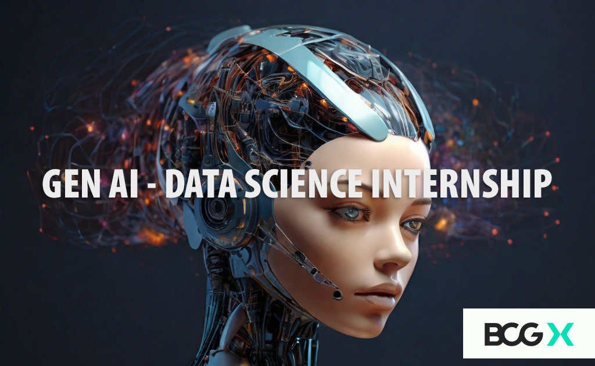

# BGCX-GenAI-Job-Simulation

## Overview

As a junior data scientist at Boston Consulting Group (BCG), I was part of the GenAI consulting team, a dynamic and diverse group where each member brings unique skills and perspectives to our projects.

One of my key responsibilities was to develop an AI-powered chatbot designed to analyze financial documents. This project sits at the cutting edge of finance and generative AI (GenAI), a rapidly growing field of interest and investment at BCG. For me, this was a golden opportunity to apply my technical expertise in AI and data analysis, while also deepening my understanding of the financial domain.

## Goal

My primary objective was to extract and analyze key financial data from the client's 10-K and 10-Q documents. This involved understanding financial statements, identifying significant trends, and preparing data for AI-driven applications.

After conducting the data analysis, I developed an AI-powered financial chatbot. This chatbot was designed to analyze financial data and provide insights that effectively communicated complex financial information in an interactive and user-friendly manner.

Throughout the project, my focus was not only on the technical execution but also on how these AI-driven insights could be leveraged in a consulting context to provide strategic recommendations and solutions to clients.

### Key terms

**10-K and 10-Q reports:** Annual and quarterly financial reports filed by publicly traded companies containing detailed information about financial performance.

**GenAI:** A branch of AI focusing on generating new content, including text and data analysis, which is crucial for the chatbot's ability to interpret and communicate financial data.

**Natural language processing (NLP):** An AI technology that the chatbot will use to understand and respond to user queries in natural language.
 
### Specific project requirements and outcomes

**Efficiency:** The solution must significantly reduce the time taken to analyze financial documents compared to traditional methods.

**Accuracy:** The chatbot should provide precise and reliable financial insights backed by thorough data analysis.

**User-friendly interface:** The chatbot should be intuitive and easy to use for diverse client base, regardless of their financial expertise.

**Scalability:** The solution should be scalable – capable of handling an increasing number of documents and user queries.

## Task One

I was tasked with several critical responsibilities in the GFC AI Chatbot project. First, I researched and reviewed 10-K financial documents, focusing on key financial figures and ratios. My goal was to extract meaningful insights from these reports to feed into the AI chatbot, enabling it to provide in-depth financial performance analysis.

Next, I performed basic analysis to identify significant financial trends and indicators, assessing the financial health and performance of the companies. After that, I formatted and cleaned the data, preparing it for integration with the AI model.

Finally, I compiled a comprehensive data analysis report. This report included my findings and a summary that provided insights into the financial health of the analyzed companies. This initial task set the foundation for our AI model and was instrumental in moving the project forward. My attention to detail and analytical skills were key in this phase.

[Task One Analysis Report on Jupyter Notebook](https://github.com/Henryzeze/BGCX-GenAI-Job-Simulation/blob/main/Analysis_Report.pdf)

## Task Two

As part of BCG's tech hub, my data extraction and analysis achievements led to a new challenge: Creating an AI chatbot that transforms complex financial data into actionable insights, aiming to revolutionize how our client navigates financial decisions by making intricate data accessible and understandable.

My primary focus was on implementing rule-based logic, a foundational aspect ensuring the chatbot could respond accurately to predefined financial queries. This task was essential for giving the chatbot its initial "understanding" of user inquiries and its ability to provide immediate, reliable information.

In developing the rule-based logic, I laid the groundwork for the chatbot's functionality, enabling further developments in AI, machine learning, and user interaction. Throughout this process, I emphasized collaboration and communication with my team, understanding that my work on rule-based logic was a critical piece of a much larger puzzle. This collaborative effort moved us closer to revolutionizing financial analysis for our client.
